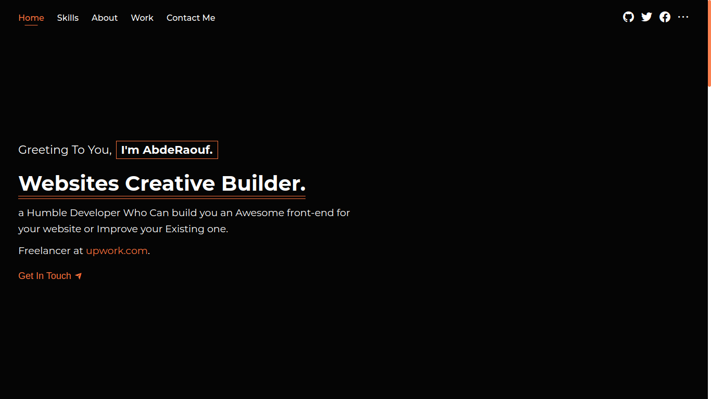

# My Portfolio

Welcome to my portfolio website where I showcase my work and skills.

## Live Website

You can visit the live version of the portfolio website by clicking [here](https://abdraoufx.netlify.app/).

## Preview Design Image

This image provides a preview of the design for the portfolio website. It serves as a visual representation of the website's layout and aesthetics.

## Technologies Used

The portfolio website is built using the following technologies:

- React: A JavaScript library for building user interfaces.
- Sass: A CSS extension language that provides more flexibility and features.
- TypeScript: A typed superset of JavaScript that compiles to plain JavaScript.
- HTML: The standard markup language for creating web pages.

These technologies were chosen to create a modern, interactive, and responsive portfolio website with enhanced styling capabilities and type safety.

## License

[Specify the license for your project, e.g., MIT License]

Feel free to customize this template further by adding additional sections or modifying the content to suit your preferences and specific details of your portfolio website.
